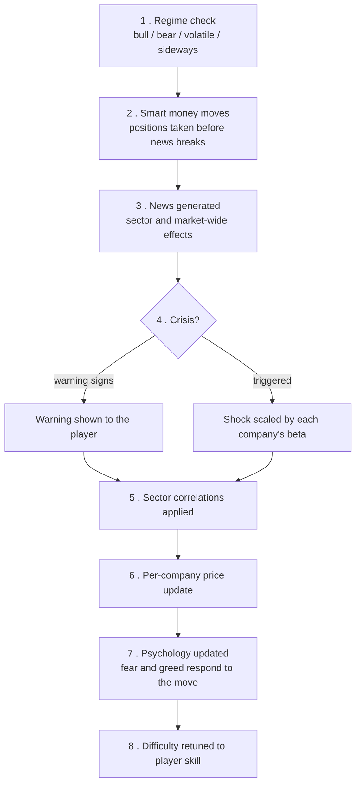

# Capital Markets Game

[](https://github.com/remicaesar/capital_markets_game/actions/workflows/tests.yml)
[](https://www.python.org/downloads/)
[](LICENSE)

A stock market simulator you play over 50 turns, built to make the *mechanics* of
markets visible: regime shifts, crowd psychology, algorithmic counterparties, margin
calls, market impact, and options decay — all as readable Python you can step through.

Ten companies across five sectors. You start with $25,000. Beating the index is
harder than it looks, and the code shows you exactly why.

Plays in the terminal or the browser.

```
┏━━━━━━━━━━━━┳━━━━━━━━━━┳━━━━━━━━━┳━━━━━━━━┳━━━━━━━┳━━━━━━━┳━━━━━━┳━━━━━━━━┓
┃ Company    ┃ Sector   ┃   Price ┃   Chg% ┃ Trend ┃  Vol% ┃  RSI ┃   Mom% ┃
┡━━━━━━━━━━━━╇━━━━━━━━━━╇━━━━━━━━━╇━━━━━━━━╇━━━━━━━╇━━━━━━━╇━━━━━━╇━━━━━━━━┩
│ PetroMax   │ Energy   │ $149.61 │   +2.2 │  📈   │   3.3 │   50 │   +0.0 │
│ SolarTech  │ Energy   │  $37.88 │   -5.0 │  💥   │   2.8 │   50 │   +0.0 │
├────────────┼──────────┼─────────┼────────┼───────┼───────┼──────┼────────┤
│ MegaBank   │ Finance  │ $137.73 │   -2.8 │  📉   │   2.7 │   50 │   +0.0 │
│ TradeDesk  │ Finance  │  $82.10 │   -4.1 │  💥   │   2.9 │   50 │   +0.0 │
├────────────┼──────────┼─────────┼────────┼───────┼───────┼──────┼────────┤
│ QuantumAI  │ Tech     │  $25.90 │   -6.3 │  💥   │   1.7 │   50 │   +0.0 │
│ TechCore   │ Tech     │ $104.83 │   -4.2 │  💥   │   3.2 │   50 │   +0.0 │
└────────────┴──────────┴─────────┴────────┴───────┴───────┴──────┴────────┘

╭──────── 📋 Advanced Stats ────────╮   ╭─────── 🎭 Market Sentiment ───────╮
│ 💰 Cash: $25,000.00               │   │ 🧠 Market Psychology              │
│ 📊 Long Positions: $0.00          │   │ 😐 Neutral (50/100)               │
╰───────────────────────────────────╯   ╰───────────────────────────────────╯
```

---

## Quick start

```bash
git clone https://github.com/remicaesar/capital_markets_game.git
cd capital_markets_game
pip install -r requirements.txt
```

**Terminal:**

```bash
python main.py                 # new game
python main.py --seed 42       # reproducible market
python main.py --load mysave   # resume a save
python main.py --list-saves    # show saves
```

**Browser** (adds options and limit orders — see the feature table below):

```bash
python run_web.py              # http://localhost:8000
```

---

## How a turn actually works

Every turn runs the same pipeline in `Market.advance_turn()`. Each stage feeds the
next, which is why a single news event can cascade into a sector-wide move:



### What sets a single company's price

`Company.update_price()` sums these, then clamps the result to ±8% per turn:

| Input | Effect |
| --- | --- |
| News and sector impact | Scaled by the regime's `news_sensitivity` — the same headline hits 4× harder in a volatile market than a bull one |
| Regime trend | Persistent drift, positive in bulls and negative in bears |
| Algorithmic pressure | Momentum, contrarian and arbitrage bots, all trading against you |
| Growth drift | The company's annual growth rate, spread across the game |
| Fear / greed | Amplifies moves in the crowd's direction at index extremes (>80 or <20) |
| Debt level | High-debt companies fall harder; downside only |
| Mean reversion | A weak pull toward a hidden intrinsic value you never see directly |
| Volatility | Gaussian shock scaled by the regime |
| Herd behaviour | Above 0.7 herd strength, moves get multiplied |

The hidden intrinsic value is the interesting one: it is set at game start somewhere
between 0.4× and 2.5× the opening price and never displayed. Arbitrage bots can see
it. You have to infer it from how prices behave.

---

## What you can trade

| | Terminal | Browser |
| --- | :---: | :---: |
| Buy / sell long | ✅ | ✅ |
| Short selling, with margin and borrow fees | ✅ | ✅ |
| Margin calls and forced liquidation | ✅ | ✅ |
| Market impact (slippage on large orders) | ✅ | ✅ |
| Dividends (earned long, owed short) | ✅ | ✅ |
| Limit / stop-loss / take-profit orders | — | ✅ |
| Call and put options | — | ✅ |
| Price and volume charts | — | ✅ |
| Save / load | ✅ | ✅ |

Costs are modelled throughout: a 1% transaction fee, 0.5% to locate borrowed shares,
0.1% per turn to hold a short, and price impact that scales with order size against
average volume. Turning a profit means clearing all of it.

### Scoring

You are graded on **alpha** (return over the market) and **Sharpe ratio**, not raw
return. Doubling your money in a market that tripled is not a good game.

If your net worth falls to zero or below, the game ends immediately as bankrupt —
in both the terminal and the browser.

---

## Layout

```
capital_markets_game/
├── main.py              # terminal game loop
├── run_web.py           # web server entry point
├── config/              # tunable constants — start here to change the game
│   ├── settings.py      # cash, fees, margin, slippage, difficulty
│   └── company_data.py  # company names per sector
├── models/
│   ├── market.py        # the orchestrator: owns every subsystem, runs the turn
│   ├── company.py       # price dynamics, P/E, RSI, momentum, beta
│   ├── player.py        # portfolio, shorts, orders, options, Sharpe, drawdown
│   ├── market_regime.py # the four regimes and the transitions between them
│   └── options.py       # simplified call/put pricing and expiry
├── systems/             # the simulation engines, one file each
│   ├── psychology.py    # fear/greed index, herd behaviour
│   ├── hidden_factors.py# intrinsic values and smart-money positioning
│   ├── algorithmic_trading.py  # momentum, contrarian and arbitrage bots
│   ├── news_system.py   # sector-specific cause-and-effect events
│   └── crisis_events.py # crashes and scandals, with warning signs
├── ui/                  # rich terminal rendering and input validation
├── utils/               # save/load, technical indicator maths
├── web/                 # FastAPI app, routes, schemas, session store
├── tests/               # pytest suite
└── legacy/              # the original single-file prototype, kept for reference
```

Two entry points share one simulation core. Nothing in `models/` or `systems/` knows
whether it is being played in a terminal or a browser.

---

## Tests

```bash
pip install -r requirements-dev.txt
pytest
```

The suite concentrates on the money maths, because that is where mistakes are silent —
a wrong number looks exactly like a right one. It covers short-position accounting,
options settlement at expiry, share-count validation, save-path safety, turn-loop
termination and the bankruptcy ending.

Every test in it was checked by reverting the fix it guards and confirming the suite
goes red. A test that passes both before and after a fix is not a test.

---

## Known limitations

Kept honest on purpose — this is a teaching codebase, and pretending otherwise would
defeat the point.

- **Concurrent web games share one RNG.** `random.seed()` is global, so starting a
  second browser game perturbs the price stream of the first. Single-player use and
  the CLI are unaffected.
- **Unused hooks.** `HiddenFactors.insider_sentiment`, `.debt_levels` and
  `.pending_news`, along with `MarketRegime.strength` and each regime's
  `correlation_mult`, are populated and saved but not yet read by anything. They are
  scaffolding for mechanics that are not implemented.
- **Complacency and capitulation risk are indicators only.** They are computed and
  displayed but do not currently move prices.
- **Options pricing is deliberately simplified.** Intrinsic value plus a time value
  that decays with the square root of remaining turns — not Black-Scholes.
- **Sector correlations are static.** They do not widen in bear markets the way real
  ones do.
- **A margin call can drive cash negative.** The game continues as long as net worth
  stays above zero.

---

## Roadmap

- Per-session RNG so concurrent web games stay independent
- Wire up (or remove) the unused hidden-factor hooks
- Options and limit orders in the terminal client, for parity with the browser
- Regime-dependent sector correlations

---

## Contributing

Issues and pull requests are welcome. If you change anything that touches money,
please add a test and confirm it fails without your change.

## License

[MIT](LICENSE) © Emir Murat Sezer
